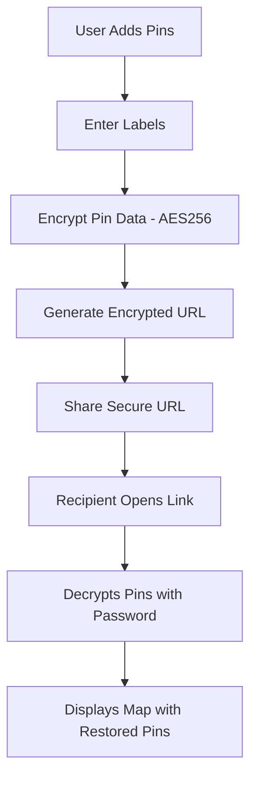

# xsukax Map Pin Generator

## Project Overview

**xsukax Map Pin Generator** is a secure, browser-based web application that enables users to create, label, and share custom map pins interactively using an intuitive interface built with **Leaflet.js** and **Tailwind CSS**. Users can click anywhere on the map to drop labeled pins, generate encrypted shareable URLs, and reopen them later or share them with others. The app’s design emphasizes simplicity, privacy, and full client-side functionality—no server or backend dependency is required.

### Core Functionalities

* Interactive world map powered by OpenStreetMap tiles.
* Add, label, and remove custom pins dynamically.
* Generate **securely encrypted URLs** to share pin data with others.
* View saved pins by decrypting URLs using user-supplied passwords.
* Works entirely offline after initial load—no data is sent to external servers.

---

## Security and Privacy Benefits

The application is designed with **data privacy and client-side security** as top priorities. All sensitive operations, including encryption and decryption, occur locally within the user’s browser.

Key security mechanisms include:

* **AES-256 Encryption (CryptoJS):** All pin data is encrypted using AES-256 in CBC mode, with a unique salt and IV for each session.
* **Password-based Encryption:** Users define a custom password, which is never stored or transmitted. This password is used to derive an encryption key through PBKDF2 key stretching.
* **Zero Server Storage:** The app does not rely on any database or backend API; no personal or location data ever leaves the user’s device.
* **Secure Shareable Links:** Encrypted pin data is embedded directly in the generated URL, ensuring that only recipients with the correct password can decrypt and view pins.

These design principles make **xsukax Map Pin Generator** ideal for users who value **confidentiality, self-sovereign data control, and encryption-first collaboration**.

---

## Features and Advantages

* 🗺️ **Interactive Map Interface** – Intuitive drag, zoom, and click-based pin management.
* 🔐 **End-to-End Encryption** – Secure sharing using AES-256 without server storage.
* 💬 **Custom Labels** – Assign meaningful names or identifiers to each pin.
* 🌍 **Portable and Lightweight** – Single-page HTML file with zero dependencies beyond CDN libraries.
* 📱 **Responsive Design** – Fully functional on desktop, tablet, and mobile devices.
* 🔗 **Encrypted Share Links** – Generate and share URLs that only authorized users can decrypt.
* ⚙️ **No Installation Required** – Runs instantly in any modern browser.

---

## Installation Instructions

Since the app is fully client-side, installation is minimal.

1. **Clone or download the repository:**

   ```bash
   git clone https://github.com/xsukax/xsukax-Map-Pin-Generator.git
   ```
2. **Navigate to the project folder:**

   ```bash
   cd xsukax-Map-Pin-Generator
   ```
3. **Open the application:**

   * Simply open `index.html` in your web browser.
   * Alternatively, host the file locally using any lightweight HTTP server (e.g., `python -m http.server`).

No dependencies, builds, or installations are required.

---

## Usage Guide

1. **Open the app** in your preferred browser.
2. **Add pins:** Click anywhere on the map to add a pin, then enter a label.
3. **Manage pins:** Remove unwanted pins directly from the map or from the list on the right.
4. **Generate an encrypted shareable URL:**

   * Click **“Generate Shareable URL.”**
   * Set and confirm your encryption password.
   * Copy or open the generated secure link.
5. **Decrypt shared data:** If you receive an encrypted link, paste it in your browser and enter the correct password when prompted.

### Process Visualization (Mermaid Diagram)



This flow ensures that **only authorized recipients** can access shared map data.

---

## Licensing Information

This project is licensed under the **GNU General Public License v3.0**.

---

**Repository:** [xsukax/xsukax-Map-Pin-Generator](https://github.com/xsukax/xsukax-Map-Pin-Generator)

**Author:** xsukax

**Technologies Used:** HTML5, Tailwind CSS, Leaflet.js, Font Awesome, CryptoJS
